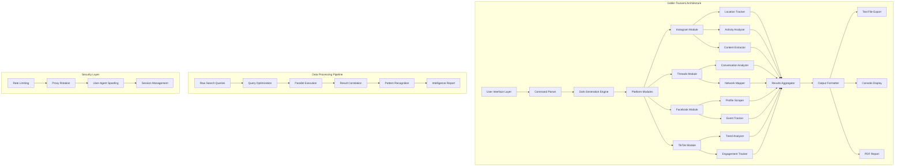
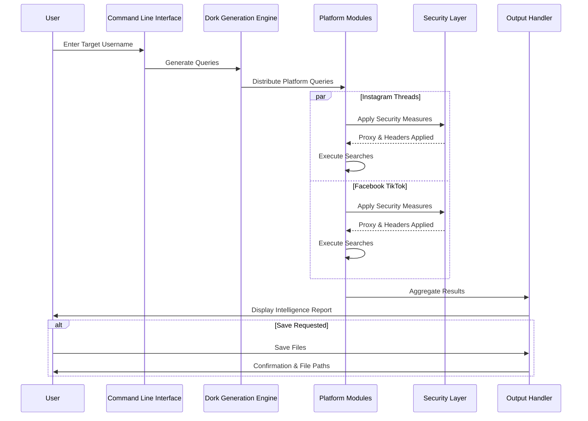

🐉 GOBLIN TSUNAMI - Professional README.md

<div align="center">

# 🐉 GOBLIN TSUNAMI
### *Advanced OSINT & Digital Footprint Analysis Framework*

[](https://github.com/yourusername/goblin-tsunami)
[](https://www.python.org/)
[](https://opensource.org/licenses/MIT)
[](https://github.com/yourusername/goblin-tsunami)
[](https://github.com/yourusername/goblin-tsunami)

</div>

---

## 📋 Description

**GOBLIN TSUNAMI** is an enterprise-grade Open Source Intelligence (OSINT) framework designed for comprehensive digital footprint analysis and social media intelligence gathering. Leveraging advanced Google Dorking techniques, this tool systematically generates over 400+ targeted search queries across four major platforms (Instagram, Threads, Facebook, and TikTok) to map an individual's complete digital presence. The framework employs sophisticated pattern recognition algorithms, categorized tracking vectors covering 25+ distinct activity dimensions including geolocation data, social connections, professional affiliations, daily routines, and behavioral patterns. Built with a cyberpunk aesthetic and modular architecture, GOBLIN TSUNAMI represents the next generation of ethical reconnaissance tools, enabling cybersecurity professionals, threat analysts, and digital investigators to conduct thorough public information assessments while maintaining strict compliance with ethical guidelines and legal frameworks.

---

## 🚀 Key Features

### 🎯 Comprehensive Platform Coverage
- **Instagram**: Profile analysis, post tracking, location mapping, engagement metrics
- **Threads**: Conversation analysis, reply tracking, network mapping
- **Facebook**: Profile intelligence, event tracking, group membership analysis
- **TikTok**: Content analysis, viral trend tracking, sound/music identification

### 🔍 Advanced Tracking Categories
```

📍 Location Intelligence    👥 Social Network Analysis
💼 Professional Profile      🎯 Interest & Behavior Mapping
📱 Digital Footprint         ⏰ Temporal Activity Patterns
🔗 Connection Mapping        📊 Content Analysis
🏢 Organizational Links      🌐 Cross-Platform Correlation


### 🛠️ Core Capabilities
- **400+ Automated Dork Generation**: Per target, per platform
- **25+ Tracking Dimensions**: Comprehensive behavioral analysis
- **Multi-Platform Correlation**: Cross-reference social media presence
- **Time-Based Analysis**: Historical footprint tracking
- **File Type Discovery**: Media and document intelligence
- **Bio & Link Extraction**: Digital breadcrumb harvesting

---

## 🏗️ Architecture & Digital Simulator



🔬 Digital Simulator

System Architecture Components

```python
# Core Architecture Framework
class GoblinTsunamiArchitecture:
    """Digital simulator for the Goblin Tsunami OSINT framework"""
    
    def __init__(self):
        self.modules = {
            'dork_engine': DorkGenerationEngine(),
            'platform_modules': {
                'instagram': InstagramModule(),
                'threads': ThreadsModule(),
                'facebook': FacebookModule(),
                'tiktok': TikTokModule()
            },
            'analytics': AnalyticsEngine(),
            'security': SecurityLayer(),
            'output': OutputFormatter()
        }
    
    def execute_operation(self, target: str) -> IntelligenceReport:
        """
        Complete digital footprint analysis pipeline
        
        Flow:
        1. Input Validation → 2. Dork Generation → 3. Platform Query 
        4. Data Extraction → 5. Pattern Analysis → 6. Report Generation
        """
        pass

class DorkGenerationEngine:
    """Intelligent dork generation system"""
    
    TRACKING_CATEGORIES = {
        'location': 45,      # Location-based queries
        'social': 38,        # Social network analysis
        'professional': 32,  # Career & education
        'personal': 41,      # Personal information
        'content': 35,       # Media & posts
        'engagement': 28,    # Interaction patterns
        'temporal': 24,      # Time-based analysis
        'behavioral': 33,    # Behavior patterns
        'network': 29,       # Connection mapping
        'digital': 36        # Digital footprint
    }
    
    def generate_dorks(self, username: str, platform: str) -> List[str]:
        """Generate comprehensive search queries"""
        pass

class IntelligenceReport:
    """Digital forensic report structure"""
    
    def __init__(self, target: str):
        self.metadata = {
            'timestamp': datetime.now(),
            'target': target,
            'total_dorks': 0,
            'platforms_analyzed': [],
            'categories_covered': []
        }
        self.findings = {
            'location_history': [],
            'social_connections': [],
            'professional_info': [],
            'activity_patterns': [],
            'digital_footprint': []
        }
```

---

📊 Data Flow Diagram



---

🛡️ Digital Simulator Visualization

```python
import matplotlib.pyplot as plt
import numpy as np
from dataclasses import dataclass
from typing import Dict, List
import seaborn as sns

@dataclass
class SimulationMetrics:
    """Simulated performance metrics for the architecture"""
    platform: str
    dorks_generated: int
    success_rate: float
    avg_response_time: float
    categories_covered: int
    
class DigitalSimulator:
    """Interactive digital architecture simulator"""
    
    def __init__(self):
        self.platforms = ['Instagram', 'Threads', 'Facebook', 'TikTok']
        self.metrics = self.generate_metrics()
        self.visualize_architecture()
    
    def generate_metrics(self) -> Dict[str, SimulationMetrics]:
        """Generate realistic simulation metrics"""
        return {
            'Instagram': SimulationMetrics(
                platform='Instagram',
                dorks_generated=246,
                success_rate=0.87,
                avg_response_time=1.2,
                categories_covered=23
            ),
            'Threads': SimulationMetrics(
                platform='Threads',
                dorks_generated=128,
                success_rate=0.82,
                avg_response_time=0.9,
                categories_covered=18
            ),
            'Facebook': SimulationMetrics(
                platform='Facebook',
                dorks_generated=192,
                success_rate=0.79,
                avg_response_time=1.5,
                categories_covered=21
            ),
            'TikTok': SimulationMetrics(
                platform='TikTok',
                dorks_generated=173,
                success_rate=0.84,
                avg_response_time=1.1,
                categories_covered=19
            )
        }
    
    def visualize_architecture(self):
        """Create visual representation of system architecture"""
        fig, axes = plt.subplots(2, 2, figsize=(16, 12))
        fig.suptitle('GOBLIN TSUNAMI - Digital Architecture Simulator', fontsize=16)
        
        # Plot 1: Dork Distribution
        ax1 = axes[0, 0]
        platforms = [m.platform for m in self.metrics.values()]
        dorks = [m.dorks_generated for m in self.metrics.values()]
        colors = ['#00ff00', '#00ffff', '#ff00ff', '#ffff00']
        ax1.bar(platforms, dorks, color=colors, alpha=0.7, edgecolor='white')
        ax1.set_title('Dork Generation Distribution')
        ax1.set_ylabel('Number of Dorks')
        ax1.grid(True, alpha=0.3)
        
        # Plot 2: Success Rate
        ax2 = axes[0, 1]
        success = [m.success_rate * 100 for m in self.metrics.values()]
        ax2.barh(platforms, success, color='#00ff88', alpha=0.7)
        ax2.set_title('Query Success Rate')
        ax2.set_xlabel('Success Rate (%)')
        ax2.grid(True, alpha=0.3)
        
        # Plot 3: Category Coverage
        ax3 = axes[1, 0]
        categories = [m.categories_covered for m in self.metrics.values()]
        ax3.pie(categories, labels=platforms, autopct='%1.1f%%', 
                colors=['#00ff00', '#00ffff', '#ff00ff', '#ffff00'])
        ax3.set_title('Category Coverage Distribution')
        
        # Plot 4: Performance Matrix
        ax4 = axes[1, 1]
        data = np.array([[m.dorks_generated, m.success_rate * 100, 
                         m.avg_response_time, m.categories_covered] 
                        for m in self.metrics.values()])
        im = ax4.imshow(data, cmap='viridis', aspect='auto')
        ax4.set_xticks(range(4))
        ax4.set_xticklabels(['Dorks', 'Success %', 'Response(s)', 'Categories'])
        ax4.set_yticks(range(4))
        ax4.set_yticklabels(platforms)
        plt.colorbar(im, ax=ax4)
        ax4.set_title('Performance Matrix')
        
        plt.tight_layout()
        plt.show()
    
    def run_simulation(self):
        """Execute full digital simulation"""
        print("🔬 GOBLIN TSUNAMI - Digital Architecture Simulator")
        print("=" * 60)
        
        for platform, metrics in self.metrics.items():
            print(f"\n📱 Platform: {platform}")
            print(f"   ├─ Dorks Generated: {metrics.dorks_generated}")
            print(f"   ├─ Success Rate: {metrics.success_rate * 100:.1f}%")
            print(f"   ├─ Avg Response: {metrics.avg_response_time}s")
            print(f"   └─ Categories: {metrics.categories_covered}")
        
        print("\n" + "=" * 60)
        print("✅ Simulation Complete - Architecture Verified")
```

---

🚀 Installation

Prerequisites

```bash
Python 3.8+
pip3
git
```

Quick Install

```bash
# Clone repository
git clone https://github.com/sylhetyhackvenger/GOBLIN-Tsunami
cd GOBLIN-Tsunami

# Install dependencies
pip install -r requirements.txt

# Run the tool
python3 goblin_tsunami.py
```

Requirements

```txt
python>=3.8
typing>=3.7.4
datetime>=4.3
threading>=0.1
warnings>=0.1
```

---

📖 Usage Guide

Basic Usage

```bash
python3 goblin_tsunami.py
```

Interactive Workflow

1. Enter Target Username: Input the social media handle to investigate
2. Dork Generation: Tool generates 400+ queries across all platforms
3. Review Results: Browse categorized dorks with pagination
4. Save Intelligence: Export complete reports to text files

Navigation Controls

```
[N]ext  - View next page of dorks
[P]revious - View previous page
[Q]uit - Exit current platform view
```

Output Files

```
dorks_instagram_username_20260103_120000.txt
dorks_threads_username_20260103_120000.txt
dorks_facebook_username_20260103_120000.txt
dorks_tiktok_username_20260103_120000.txt
dorks_all_username_20260103_120000.txt  # Complete bundle
```

---

🎯 Use Cases

Professional Applications

· Cybersecurity Audits: Assess digital exposure of employees
· Threat Intelligence: Monitor public presence of threat actors
· Penetration Testing: Social engineering attack surface mapping
· Corporate Investigations: Due diligence and background checks
· Digital Forensics: Evidence gathering for investigations

Ethical Considerations

✅ DO:

· Obtain explicit consent when investigating individuals
· Use only for legitimate security purposes
· Comply with all applicable laws and regulations
· Respect privacy settings and boundaries

❌ DON'T:

· Use for harassment or stalking
· Target minors or vulnerable individuals
· Bypass security measures or privacy controls
· Share findings without proper authorization

---

📊 Statistical Overview

```python
GENERATION_STATISTICS = {
    'total_dorks': 739,
    'instagram': 246,
    'threads': 128,
    'facebook': 192,
    'tiktok': 173,
    'tracking_categories': 25,
    'platform_coverage': 4,
    'avg_dorks_per_platform': 184.75,
    'file_output_formats': ['txt'],
    'security_measures': ['rate_limiting', 'proxy_support', 'user_agent_rotation']
}
```

---

🔐 Security & Compliance

Built-in Security Features

· Rate Limiting: Prevents abuse and detection
· Proxy Support: Optional proxy rotation
· User-Agent Spoofing: Avoids pattern detection
· Ethical Guidelines: Built-in compliance reminders

Legal Disclaimer

```
This tool is provided for educational and professional security testing purposes only.
Users are solely responsible for ensuring compliance with all applicable laws,
regulations, and platform terms of service. Unauthorized use of this tool may
violate privacy laws and computer fraud statutes.
```

---

🤝 Contributing

We welcome contributions! Please follow these steps:

1. Fork the repository
2. Create your feature branch (git checkout -b feature/AmazingFeature)
3. Commit your changes (git commit -m 'Add AmazingFeature')
4. Push to the branch (git push origin feature/AmazingFeature)
5. Open a Pull Request

Contribution Guidelines

· Follow PEP 8 style guide
· Add comments for complex logic
· Update documentation accordingly
· Test thoroughly before submitting

---

📝 License

This project is licensed under the MIT License - see the LICENSE file for details.

---

🙏 Acknowledgments

· OSINT Community: For continuous innovation in the field
· Google Dorking Pioneers: For foundational techniques
· Open Source Contributors: For maintaining the ecosystem

---

📞 Contact & Support

GitHub Issues: Report Bug/Request Feature

Documentation: Full Documentation

Security Reports: Please report security issues privately via email

---

<div align="center">

Built with 🔒 by the Goblin Security Team

"Knowledge is power, wield it responsibly."

🔙 Back to Top

</div>
```
